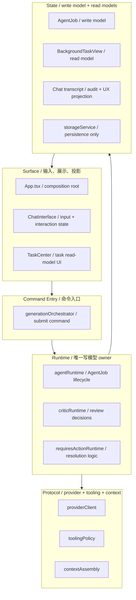

# 图像生成 Agent 架构重构地图 V3

基于对 `ai-vision-studio` 当前实现的三轮静态审查，以及更新后的 agent 架构 skill，本文档给出一版面向实施的重构方案。

相对 V2，这一版补齐了最后两块关键 contract：

1. `Write-model Mutation Owner`
2. `Reverse Command Contract`

没有这两块，系统即使完成了 `truth source`、`transcript role`、`event boundary` 的收紧，仍然会在取消、恢复、刷新中断、requires-action 解决、任务中心移除等路径上重新分叉。

## 1. 设计结论

当前项目已经具备真实的图像生成 agent 骨架，但还没有形成稳定的 agent runtime contract。  
最核心的问题不再是“模块太大”，而是“谁能推进写模型、哪些反向动作是正式命令”。

V3 的核心结论如下：

1. `AgentJob` 是唯一执行写模型。
2. `agentRuntime` 是唯一写模型变更 owner。
3. `BackgroundTaskView` 是派生读模型，不独立推进生命周期。
4. `Chat transcript` 是 `audit + UX projection`，不是执行真相。
5. `generationOrchestrator` 只能发命令、收结果、转发事件，不能偷偷推进 `AgentJob`。
6. 取消、恢复、解决 requires-action、移除任务视图必须进入正式命令体系。

## 2. 当前问题定位

### 2.1 双写模型仍然存在

当前 `AgentJob` 与 `BackgroundTask` 同时被创建、保存、推进：

- [types.ts](/mnt/d/project/ai-vision-studio/types.ts:400)
- [types.ts](/mnt/d/project/ai-vision-studio/types.ts:550)
- [App.tsx](/mnt/d/project/ai-vision-studio/App.tsx:1633)
- [App.tsx](/mnt/d/project/ai-vision-studio/App.tsx:1675)

这意味着系统当前仍然有并行生命周期模型。

### 2.2 中断与取消是一等语义，但还没有统一命令模型

当前系统已经存在：

- interrupted job 恢复路径：[App.tsx](/mnt/d/project/ai-vision-studio/App.tsx:795)
- cancel task / abort controller：[App.tsx](/mnt/d/project/ai-vision-studio/App.tsx:2394)
- runtime 内部 cancelled lifecycle：[agentService.ts](/mnt/d/project/ai-vision-studio/services/agentService.ts:352)
- requires-action resolution：[requiresActionRuntime.ts](/mnt/d/project/ai-vision-studio/services/requiresActionRuntime.ts:41)

但这些动作还没有统一成一套 command contract。

### 2.3 TaskCenter 的用户动作仍然语义混载

当前 [TaskCenter.tsx](/mnt/d/project/ai-vision-studio/components/TaskCenter.tsx:175) 的 `onRemoveTask`：

- 对活动任务意味着取消
- 对完成/失败任务意味着移除展示

同一个 UI action 同时承担 `domain command` 和 `projection cleanup`，这会让读模型边界重新塌陷。

### 2.4 ChatInterface 仍然是第二 runtime

`ChatInterface` 里的 `AgentStateMachine` 仍持有 retry、confirmation、execution progression：

- [ChatInterface.tsx](/mnt/d/project/ai-vision-studio/components/ChatInterface.tsx:343)
- [ChatInterface.tsx](/mnt/d/project/ai-vision-studio/components/ChatInterface.tsx:390)
- [agentService.ts](/mnt/d/project/ai-vision-studio/services/agentService.ts:13)

这意味着即使抽出 orchestrator，只要这个 state machine 不降级，系统仍会有第二个 runtime owner。

## 3. 目标分层

## 4. 核心 Ownership 决策

### 4.1 Truth Source Decision

`AgentJob` 是唯一执行写模型。  
以下语义只能写入 `AgentJob`：

- 当前 job status
- 当前 step
- review / revision / requires_action / interrupted / cancelled
- 恢复点
- artifact 关联
- job 级错误语义

### 4.2 Read-model versus Write-model Decision

`BackgroundTask` 应收缩为 `BackgroundTaskView`，作为从 `AgentJob` 派生出的查询/展示模型。  
它可以有自己的展示字段，但不能独立定义：

- `QUEUED`
- `GENERATING`
- `REVIEWING`
- `ACTION_REQUIRED`
- `COMPLETED`
- `FAILED`

这些状态都必须映射自 `AgentJob`。

### 4.3 Write-model Mutation Owner Decision

`agentRuntime` 是唯一允许推进 `AgentJob` 的 owner。  
这意味着：

- `generationOrchestrator` 不能自己改写 `AgentJob`
- `storageService` 不能通过“订阅事件后再决定如何推进写模型”来二次拥有 lifecycle 语义
- surface 层不能直写 `AgentJob`

建议 contract 改成：

- runtime 接收命令
- runtime 计算并产出新的 `AgentJob snapshot` 或 `JobTransitionResult`
- persistence 只负责保存 runtime 已决策好的结果

如果将来要走 event-sourcing，需要单独声明，不应与“普通写模型”混写。

### 4.4 Transcript Role Decision

`ChatMessage` / `toolCalls` 明确定义为：

- `audit log`
- `UX projection`

它们可以记录：

- 用户可见 tool trace
- requires-action 卡片内容
- resolution 结果展示

但不再作为以下语义的唯一主记录：

- lifecycle recovery
- job progression
- requires_action owner state

### 4.5 Reverse Command Contract

以下反向或控制类动作必须进入正式命令体系：

- `CancelJob`
- `ResumeJob`
- `ResolveRequiresAction`
- `RetryJobStep` 或 `RetryJob`
- `DismissTaskView`
- `ClearCompletedTaskViews`

其中必须明确区分：

- `domain command`：改变写模型
- `projection command`：只清理读模型或 UI 投影

不能再让一个 `X` 按钮同时承担两种语义。

### 4.6 Event / Side-effect Boundary Decision

runtime 仍然需要输出中立事件，但这些事件不再负责“决定如何推进写模型”。  
事件只用于：

- surface projection
- read-model derivation
- asset store update
- toast / sound / telemetry

建议事件至少包含：

- `JobQueued`
- `StepStarted`
- `AssetProduced`
- `ReviewStarted`
- `ReviewCompleted`
- `RequiresActionRaised`
- `RequiresActionResolved`
- `JobInterrupted`
- `JobCancelled`
- `JobCompleted`
- `JobFailed`

## 5. 命令与事件模型

### 5.1 Commands

| Command | Owner | Effect |
| --- | --- | --- |
| `StartGeneration` | `generationOrchestrator -> agentRuntime` | 创建新 job 或进入执行 |
| `ResumeJob` | `generationOrchestrator -> agentRuntime` | 从 interrupted / blocked 状态恢复 |
| `CancelJob` | `generationOrchestrator -> agentRuntime` | 将写模型推进到 cancelled |
| `ResolveRequiresAction` | `generationOrchestrator -> requiresActionRuntime -> agentRuntime` | 关闭 blocked state 并写回 resolution |
| `RetryJob` / `RetryStep` | `generationOrchestrator -> agentRuntime` | 重新进入执行路径 |
| `DismissTaskView` | `Surface -> read-model layer` | 只移除读模型投影，不改写 job |
| `ClearCompletedTaskViews` | `Surface -> read-model layer` | 清理已完成/失败/已处理视图 |

### 5.2 Events

| Event | Producer | Consumers |
| --- | --- | --- |
| `JobQueued` | runtime | read model, transcript, UI |
| `StepStarted` | runtime | transcript, UI |
| `AssetProduced` | runtime | asset store, transcript, UI |
| `ReviewCompleted` | runtime | transcript, read model, UI |
| `RequiresActionRaised` | runtime | transcript, read model, UI |
| `RequiresActionResolved` | runtime | transcript, read model, UI |
| `JobInterrupted` | runtime | read model, transcript, UI |
| `JobCancelled` | runtime | read model, transcript, UI |
| `JobCompleted` | runtime | read model, transcript, UI |
| `JobFailed` | runtime | read model, transcript, UI |

## 6. 模块职责表

| 模块 | 目标职责 | 不再负责 |
| --- | --- | --- |
| `App.tsx` | dependency wiring、command submission、state subscription | job lifecycle mutation |
| `ChatInterface.tsx` | input、tool-call display、interaction-only state | retry / progression / lifecycle ownership |
| `TaskCenter.tsx` | render read-models、emit explicit UI intents | decide whether a task cancel changes the write model |
| `generationOrchestrator` | transform UI intent into commands, route results | mutate `AgentJob` directly |
| `agentRuntime` | own `AgentJob` mutation and lifecycle decisions | transcript storage, UI callbacks |
| `requiresActionRuntime` | compute resolution semantics for blocked states | own transcript truth |
| `storageService` | persist snapshots and query read models | decide lifecycle transitions |
| `BackgroundTaskView` pipeline | derive task projections from runtime output | independent lifecycle progression |

## 7. 关键连接表

| From | Relation | To | 说明 |
| --- | --- | --- | --- |
| `Surface` | emits intent | `generationOrchestrator` | surface 只发明确意图 |
| `generationOrchestrator` | submits command | `agentRuntime` | 统一命令入口 |
| `agentRuntime` | mutates | `AgentJob` | 唯一写模型 owner |
| `agentRuntime` | requests capability | `Protocol` | 请求模型、tooling、context 能力 |
| `agentRuntime` | emits event | `Projection Consumers` | 事件驱动读模型和 UI 副作用 |
| `Projection Consumers` | derive | `BackgroundTaskView` | 只生成读模型 |
| `Projection Consumers` | project | `Transcript` | 只生成审计和 UX 轨迹 |
| `storageService` | persists snapshot | `AgentJob` | 保存，不决策 |

## 8. 反模式检查

这轮审查后，项目里最关键的反模式是：

- multiple execution truths
- write-model mutation owner ambiguity
- reverse commands missing from runtime contract
- one UI action overloaded between domain mutation and projection cleanup
- transcript carrying hidden domain state
- UI state machine as second runtime
- orchestrator extraction before event/result contract

## 9. 实施顺序

### Phase 1：先钉死写模型 owner 和命令模型

目标：

- 先解决“谁能改写 `AgentJob`”
- 先把 cancel / resume / resolve-action 变成正式命令

动作：

- 定义 `JobCommand` 类型
- 定义 `JobTransitionResult` 或 `AgentJob snapshot` contract
- 让 `storageService` 退回到 save/query owner

完成标准：

- 只有 runtime 能推进写模型
- `CancelJob` / `ResumeJob` / `ResolveRequiresAction` 有明确入口

### Phase 2：把 `BackgroundTask` 降成读模型

目标：

- 消除双写模型

动作：

- 将 `BackgroundTask` 语义改为派生视图
- 拆分 `CancelJob` 与 `DismissTaskView`
- 拆分 `ClearCompletedTaskViews` 与 job lifecycle

完成标准：

- `TaskCenter` 不再依赖独立 task lifecycle 真相
- `X` 按钮语义不再混载

### Phase 3：定义 transcript contract 和 event boundary

目标：

- 把 transcript 从 domain truth 中降级
- 定义 projection event 体系

动作：

- 明确 `toolCalls` 的审计字段和投影字段
- 定义 `JobCancelled` / `JobInterrupted` / `RequiresActionResolved` 事件

完成标准：

- transcript 只做 audit + UX projection
- projection 更新不再决定写模型状态

### Phase 4：抽 `generationOrchestrator`

目标：

- 把入口从 `App.tsx` 抽走，但不复制 runtime owner

动作：

- 迁出命令入口
- `App.tsx` 只做 wiring 和 subscription

完成标准：

- orchestrator 不直接写 job
- side effects 不再靠 ad hoc callback 绑定

### Phase 5：去掉 ChatInterface 中的第二 runtime，并拆协议层

目标：

- 去掉 client-side runtime owner
- 明确 provider / tooling / context owner

动作：

- 将 `AgentStateMachine` 收缩为 interaction controller
- 将 `geminiService.ts` 拆成 provider client、tooling policy、context assembly

完成标准：

- UI 不再持有 execution semantics
- runtime 不再依赖 provider 细节对象

## 10. 迁移与回滚

### 10.1 迁移原则

- 先定 owner，再抽文件
- 先定 command contract，再拆 UI 行为
- 先去掉并行写模型，再谈 event-driven projection

### 10.2 主要风险

- `CancelJob` 和 `DismissTaskView` 拆分后，任务中心交互短期需要重新定义
- transcript 降级后，现有 requires-action 卡片的数据来源需要重接
- `AgentStateMachine` 去 runtime 化时，可能暴露现有 retry 依赖链

### 10.3 回滚策略

- 每个 phase 独立提交
- 先引入显式 command / result contract，再逐步迁移调用方
- 即使短期保留旧 UI handler，也必须让它们调用正式命令，而不是直写状态

## 11. 建议的首批落地点

如果只做三件事，优先级如下：

1. 定义 `JobCommand` 与 `JobTransitionResult`，明确 runtime 是唯一写模型 owner
2. 把 `CancelJob`、`ResumeJob`、`ResolveRequiresAction`、`DismissTaskView` 分开
3. 把 `BackgroundTask` 改成派生读模型，而不是并行生命周期实体

这三步完成后，再去抽 orchestrator 和拆协议层，风险会低得多。
