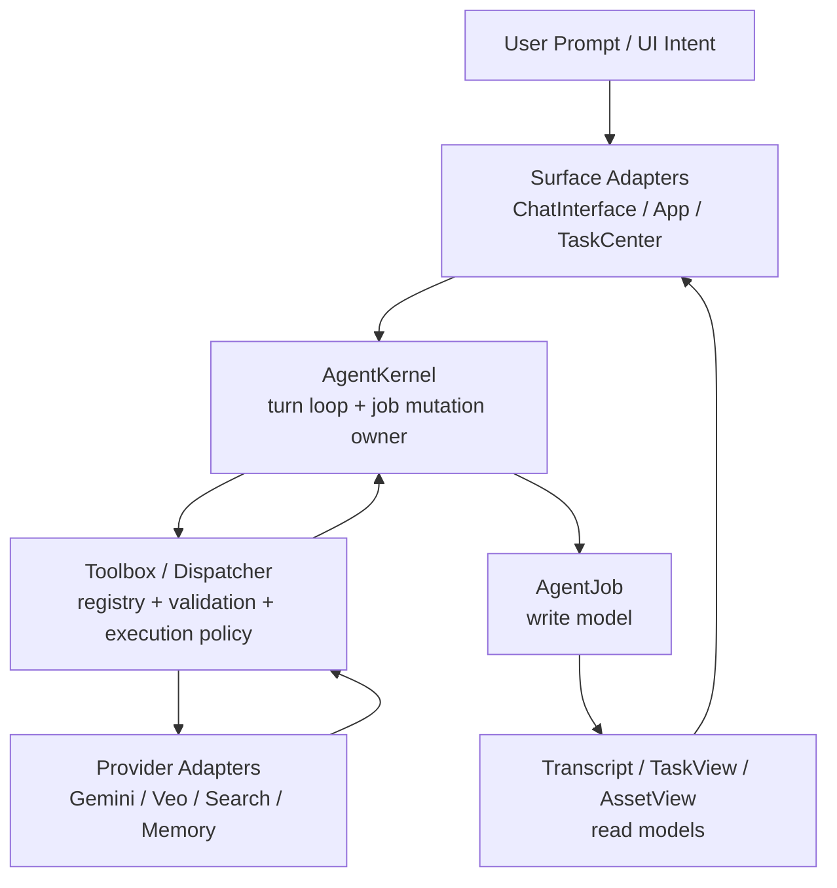
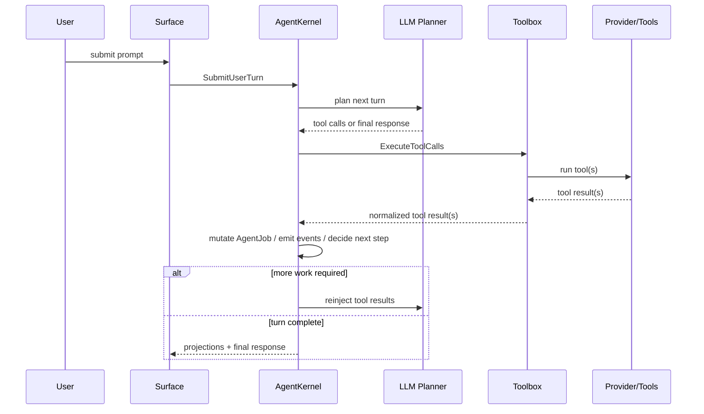

## Context
The project now has most of the structural pieces of an agent system:
- a chat-side streaming/tool loop
- a generation task runtime with persistent `AgentJob`
- a critic/requires-action decision flow
- task and transcript projections

But these pieces were assembled incrementally and still behave like adjacent runtimes rather than one kernel. The result is duplicated ownership, especially across:
- chat execution semantics
- generation/review lifecycle mutation
- tool-call versus task-flow fan-out semantics
- page-level orchestration in `App.tsx`

## Goals / Non-Goals
- Goals:
  - establish one runtime kernel for chat + generation + review + requires-action
  - unify tool execution behind one toolbox/dispatcher contract
  - keep `AgentJob` as the only execution write model
  - make transcript and task views purely derived
  - support sequence generation as a first-class multi-tool-call workflow
- Non-Goals:
  - redesign the visual UI
  - replace Gemini provider logic wholesale
  - introduce event sourcing unless it becomes strictly necessary

## Decisions

### Decision: Introduce a single `AgentKernel`
The system will expose one kernel entry that accepts commands such as:
- `SubmitUserTurn`
- `ExecuteToolCalls`
- `ResolveRequiresAction`
- `CancelJob`
- `ResumeJob`

The kernel owns:
- current turn state
- current job mutation decisions
- tool-result reinjection
- transition event emission

Surface layers do not directly mutate jobs or reconstruct transition logic.

### Decision: Split execution truth into `TurnRuntimeState` and `AgentJob`
The unified kernel still needs one execution truth, but not every turn should become a persisted generation job.

The system will therefore use two write models with explicit ownership:

1. `TurnRuntimeState`
   - kernel-owned
   - ephemeral or session-scoped by default
   - tracks the active user turn, streamed assistant output, planned tool calls, tool-result reinjection state, and non-generation reasoning progression

2. `AgentJob`
   - kernel-owned and persisted
   - created only when the turn crosses into long-running or recoverable work such as image generation, video generation, review/revision, requires-action wait states, resume, or cancel/retry targets
   - remains the only persisted execution truth for background/recoverable work

Rule:
- every recoverable generation/review lifecycle is represented by `AgentJob`
- chat-only turns that do not create recoverable work stay in `TurnRuntimeState`
- `TurnRuntimeState` may reference `activeJobId`, but it does not replace `AgentJob`

### Decision: Separate `Kernel`, `Toolbox`, and `Provider`
The new architecture has three runtime bands:

1. `AgentKernel`
   - execution loop owner
   - write-model owner
   - event producer

2. `Toolbox`
   - normalized tool registry
   - tool dispatch policy
   - mapping from tool name -> executor

3. `Provider`
   - Gemini/Veo/model-specific adapters
   - search/model/config details

This prevents provider details from leaking into orchestration and prevents page code from bypassing the dispatcher.

### Decision: Classify tools by execution semantics, not only by name
The toolbox cannot treat every callable capability as the same kind of tool. The dispatcher contract therefore includes explicit tool classes:

1. `interactive_tool`
   - short-lived
   - executed inline during a turn
   - result is immediately reinjected into the same turn loop
   - examples: `memory_search`, `update_memory`

2. `job_tool`
   - creates or advances a persisted `AgentJob`
   - may be long-running, cancellable, resumable, or reviewable
   - examples: `generate_image`, `generate_video`

3. `kernel_step`
   - not exposed as a free-form user tool
   - executed by the kernel as part of a known lifecycle transition
   - examples: `review_asset`, `resolve_requires_action`

Rule:
- only `interactive_tool` results are blindly reinjected as same-turn tool results
- `job_tool` results return a normalized `JobTransitionResult`
- `kernel_step` results are consumed only by the kernel transition graph

This classification prevents long-running generation or review work from being flattened into the same semantics as a lightweight internal tool call.

### Decision: Treat generation/review/requires-action as tool-mediated kernel work
`generate_image`, `review_asset`, `resolve_requires_action`, and related actions all become kernel-visible tool or command steps.

That means:
- sequence generation is represented as multiple planned tool calls
- review/revision is not a side pipeline; it is kernel-owned progression
- retry/cancel/resume operate on the same turn/job graph

### Decision: Keep `AgentJob` as write model and projections as derived
`AgentJob` remains the only execution truth.

Derived projections:
- `BackgroundTaskView`
- `Chat transcript`
- visible asset collections
- toast / telemetry / thought display state

These may be cached or persisted for UX, but they must be reconstructable from kernel-decided results.

### Decision: Recovery rebuilds from write models, not from projections
Recovery strategy is fixed as follows:

- `AgentJob` is the persisted truth for recoverable execution
- `BackgroundTaskView` is rebuilt from `AgentJob` snapshots on reload
- visible asset projection is rebuilt from persisted assets plus `AgentJob` state when necessary
- transcript remains persisted for UX/audit, but is not a recovery authority for lifecycle mutation

Projection caches may still be persisted for startup speed, but startup recovery must be defined as:
1. load persisted jobs/assets/transcript
2. repair interrupted jobs through kernel recovery rules
3. rebuild task/asset projections from the repaired write model
4. reconcile any cached projections as optimization only

### Decision: Keep projection cleanup outside the kernel command set
Not every user action belongs to the kernel.

The following remain kernel commands:
- `SubmitUserTurn`
- `ExecuteToolCalls`
- `CancelJob`
- `ResumeJob`
- `ResolveRequiresAction`

The following are projection-layer intents and must not mutate execution truth:
- `DismissTaskView`
- `ClearCompletedTaskViews`
- transcript-only UI cleanup

This preserves the V3 boundary between domain mutation and read-model cleanup.

### Decision: Add sequence-specific validation to the toolbox layer
Sequence/storyboard requests are a known failure mode.

The toolbox layer will validate:
- a request for N distinct frames must become N distinct tool calls
- each distinct call must set `numberOfImages = 1`
- shared reference IDs may repeat across calls for consistency
- prompts must differ per frame/action beat

This validation belongs at the kernel/toolbox boundary, not in the page.

## Proposed Layered Architecture

## Dynamic Flow

## Responsibility Table

| Layer | Owns | Must Not Own |
| --- | --- | --- |
| `AgentKernel` | turn progression, `TurnRuntimeState`, `AgentJob` mutation, event emission, tool-result reinjection | provider specifics, UI state |
| `Toolbox` | registry, tool classification, validation, execution dispatch, normalized tool results | write-model mutation |
| `Provider` | Gemini/Veo/search/memory APIs | lifecycle ownership |
| `Surface` | input collection, subscriptions, local display-only state | job mutation, tool semantics |
| `Projection Layer` | task views, transcript projections, asset visibility projections, projection cleanup intents | write-model mutation |
| `Storage` | save/query snapshots and cached projections | deciding transitions |

## State Table

| State Kind | Example | Owner | Persistence | Recovery Role | Notes |
| --- | --- | --- | --- | --- | --- |
| Write model | `TurnRuntimeState` | `AgentKernel` | session-scoped, ephemeral by default | not authoritative after reload unless explicitly resumed from an active session channel | tracks one active turn, streamed output, planned tool calls, reinjection progress, pending approvals within the turn |
| Write model | `AgentJob` | `AgentKernel` | durable | authoritative for recoverable generation/review/requires-action/cancel/retry/resume | only persisted execution truth for long-running or resumable work |
| Read model / projection | `BackgroundTaskView` | Projection layer | cacheable, optional persistence | rebuilt from `AgentJob` | dismiss/clear is projection cleanup only |
| Read model / projection | visible asset view | Projection layer | cacheable, optional persistence | rebuilt from persisted assets plus `AgentJob` state | asset visibility does not drive lifecycle mutation |
| Read model / projection | transcript projection | Projection layer | durable for UX/audit | not a recovery authority for lifecycle mutation | may be shown to users and partially consumed by the model through context packing |
| Cache | projection cache | Storage / projection layer | durable or memory-only | optimization only | must be discardable without semantic loss |
| Ephemeral state | local UI selection, expanded panels, draft prompt text | Surface | memory-only | none | never participates in execution truth |

## Failure Path Table

| Failure Case | Detected By | Runtime Classification | Owner Of Decision | Expected Next State | Notes |
| --- | --- | --- | --- | --- | --- |
| model call fails before any tool planning | `AgentKernel` / provider adapter | model error | `AgentKernel` | fail turn, no `AgentJob` unless one already exists | surface shows error projection only |
| tool execution times out | `Toolbox` executor | tool timeout | `AgentKernel` | retry, fail turn, or advance `AgentJob` to failed based on tool class and policy | timeout policy is defined at toolbox execution contract, not UI |
| tool permission denied | permission policy layer within toolbox | permission deny | `AgentKernel` | emit deny result, optionally continue turn with fallback | deny must be auditable and not masquerade as generic tool error |
| protocol / provider contract error | provider adapter | protocol error | `AgentKernel` | fail current turn or current job step | runtime must distinguish this from user-visible generation quality failure |
| user cancels running job | surface emits `CancelJob` | user interrupt | `AgentKernel` | job becomes cancelled and projections rebuild | cancellation is a formal domain command |
| app crash / restart while job running | startup recovery | interrupted execution | `AgentKernel` recovery rules | interrupted jobs repaired, then projections rebuilt | duplicate execution must be prevented via checkpoint / idempotency policy during implementation |
| reconnect with stale cached projections | projection layer on startup | stale projection cache | projection rebuild path | discard/reconcile cache and rebuild from write models | projections never win over write models |
| partial write between job snapshot and projection cache | storage / recovery path | partial persistence | `AgentKernel` + storage recovery path | trust durable write model, rebuild projections | storage remains passive; it does not infer lifecycle transitions |

## Permission Table

| Concern | Requested By | Approved By | Executed By | Audited By | Current Scope |
| --- | --- | --- | --- | --- | --- |
| normal turn submission | surface adapter | no explicit approval | `AgentKernel` | transcript + kernel events | always in scope |
| `interactive_tool` execution | `AgentKernel` via toolbox dispatch | unified permission policy, if required by capability | toolbox executor | kernel events + tool execution logs | current product needs this for memory/search style tools |
| `job_tool` execution | `AgentKernel` via toolbox dispatch | unified permission policy, if required by capability | toolbox executor + provider adapter | `AgentJob` history + kernel events | covers generate image/video and future resumable tools |
| `kernel_step` execution | `AgentKernel` only | no separate user approval unless step implies a human decision gate | `AgentKernel` / toolbox internal executor | kernel events | review and requires-action resolution live here |
| requires-action user confirmation | `AgentKernel` raises wait state | user through surface | `AgentKernel` resumes via `ResolveRequiresAction` | `AgentJob` + transcript projection | this is the formal human-in-the-loop path |
| projection cleanup (`DismissTaskView`, `ClearCompletedTaskViews`) | surface adapter | no approval | projection layer | UI analytics / projection logs if needed | explicitly out of kernel command set |

Notes:
- This product is currently single-surface and single-user-session oriented. Multi-surface permission variance and subagent permission inheritance are intentionally out of scope for this phase.
- Approval is a formal runtime event only for domain actions such as requires-action resolution. Pure projection cleanup remains a UI/projection concern.
- Capability-level approval, time-window approval reuse, and resource-scope narrowing remain future extensions unless implementation discovers an immediate blocker.

## Risks / Trade-offs
- This is a major refactor, not a surface cleanup. Migration risk is real.
- A unified kernel will initially feel heavier than the current V3 slices, but it removes repeated orchestration seams.
- If the toolbox contract is too generic, it can become another god-layer. Tool validation should stay narrow and explicit.

## Migration Plan
### Phase 1: Kernel envelope and compatibility façade
- Introduce `AgentKernel` interfaces and `TurnRuntimeState` without changing UI entrypoints.
- Keep [App.tsx](/mnt/d/project/ai-vision-studio/App.tsx) and [components/ChatInterface.tsx](/mnt/d/project/ai-vision-studio/components/ChatInterface.tsx) wired to compatibility controllers.
- Cutover point: chat send path routes through a kernel façade, but existing generation runtime services still execute beneath it.
- Rollback point: revert composition root wiring to current V3 controllers.

### Phase 2: Toolbox unification
- Route `interactive_tool` execution through the unified dispatcher first.
- Add tool classification and validation, especially sequence/storyboard validation.
- Cutover point: all tool calls emitted from the planner pass through the toolbox registry.
- Rollback point: fallback to current chat deferred-tool dispatcher and existing generation call adapters.

### Phase 3: Job-tool and kernel-step migration
- Move `generate_image`, `generate_video`, `review_asset`, and `resolve_requires_action` under kernel-owned transitions.
- Remove page/controller ownership of lifecycle branching.
- Cutover point: `AgentJob` mutation originates only from kernel transitions.
- Rollback point: preserve existing V3 generation flow services behind compatibility wrappers until parity tests pass.

### Phase 4: Surface demotion and cleanup
- Reduce `App.tsx` and `ChatInterface.tsx` to command submission and projection subscription.
- Remove redundant compatibility shims only after recovery, replay, and sequence tests pass.
- Final cutover point: page code no longer owns execution branching.

## Rollback Plan
- Keep existing V3 generation flow services behind compatibility adapters during the migration.
- Make the kernel entry opt-in behind composition-root wiring until the new flow passes end-to-end tests.
- Preserve the current storage schema for `AgentJob` and task projections during the first migration phase.

## Open Questions
- Should `review_asset` remain a `kernel_step` permanently, or be representable as a debug-visible tool in development mode?
- Should multi-frame sequence planning happen in the LLM plan itself, or in a deterministic kernel-side expander after one higher-level tool call?
